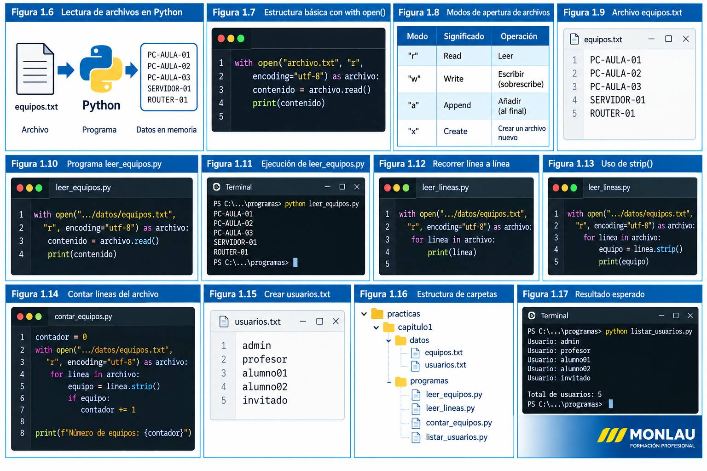

# Gestión del sistema de archivos

## 1. Introducción

Una de las aplicaciones más importantes de Python en la administración de sistemas es la **automatización de tareas relacionadas con archivos y directorios**.

Un programa Python puede, por ejemplo:

- Leer información almacenada en un archivo.
- Crear automáticamente nuevos archivos.
- Modificar archivos existentes.
- Procesar archivos de configuración.
- Leer inventarios de equipos.
- Crear informes.
- Comprobar si un archivo o una carpeta existe.
- Crear, copiar, mover o eliminar archivos y directorios.

Estas operaciones permiten construir **scripts de administración** capaces de realizar automáticamente tareas que manualmente serían repetitivas.

!!! example "Ejemplo"

    Imaginemos que administramos una red con 200 ordenadores.

    Podemos guardar sus nombres y direcciones IP en un archivo y crear un programa Python que lea automáticamente esa información para realizar diferentes operaciones sobre los equipos.

---

## 2. Archivos y directorios

Antes de trabajar con archivos desde Python debemos distinguir dos conceptos básicos.

### Archivo

Un **archivo** es una unidad de información almacenada en un dispositivo.

Algunos ejemplos son:

```text
usuarios.txt
equipos.csv
configuracion.json
informe.txt
errores.log
```

La extensión suele indicar el tipo de información almacenada:

| Extensión | Uso habitual |
|---|---|
| `.txt` | Texto |
| `.csv` | Datos separados por campos |
| `.json` | Datos estructurados |
| `.log` | Registros de actividad |
| `.py` | Programa Python |

### Directorio

Un **directorio** o carpeta permite organizar archivos y otros directorios.

Por ejemplo:

```text
proyecto/
│
├── datos/
│   ├── equipos.csv
│   └── usuarios.txt
│
├── informes/
│   └── informe.txt
│
└── programa.py
```

En este ejemplo, nuestro programa `programa.py` podría leer información de `datos/equipos.csv` y generar posteriormente un informe dentro de `informes`.

---

## 3. Rutas de archivos

Para acceder a un archivo, Python necesita conocer su **ruta**.

Una ruta indica dónde se encuentra un archivo o directorio dentro del sistema de archivos.

En Windows podemos encontrar rutas como:

```text
C:\Users\Jose\Documents\datos\equipos.csv
```

Podemos trabajar principalmente con dos tipos de rutas:

- **Rutas absolutas**
- **Rutas relativas**

### Ruta absoluta

Una ruta absoluta especifica completamente la ubicación del archivo.

Por ejemplo:

```text
C:\Users\Jose\Documents\Python\datos\equipos.csv
```

La ruta comienza desde una ubicación concreta del sistema.

El problema es que una ruta absoluta suele depender del ordenador en el que ejecutemos el programa.

Por ejemplo, este archivo:

```text
C:\Users\Jose\Documents\Python\datos\equipos.csv
```

probablemente no exista en el ordenador de otro alumno.

### Ruta relativa

Una ruta relativa indica la ubicación de un archivo tomando como referencia el directorio desde el que estamos trabajando.

Supongamos esta estructura:

```text
proyecto/
│
├── datos/
│   └── equipos.csv
│
└── programa.py
```

Desde `programa.py` podemos referirnos al archivo simplemente como:

```text
datos/equipos.csv
```

Esto hace que nuestros programas sean mucho más fáciles de trasladar entre diferentes ordenadores.

!!! tip "Recomendación"

    Siempre que sea posible utilizaremos **rutas relativas** en nuestros proyectos.

    De esta manera podremos copiar el proyecto completo a otro ordenador sin tener que modificar las rutas utilizadas por nuestros programas.

---

## 4. El directorio de trabajo

Cuando ejecutamos un programa Python existe un directorio denominado **directorio de trabajo actual**.

Podemos averiguar cuál es utilizando el módulo `os`.

Crea un archivo llamado:

```text
directorio_actual.py
```

Escribe:

```python
import os

directorio = os.getcwd()

print("Directorio de trabajo actual:")
print(directorio)
```

Ejecuta el programa desde la terminal de VS Code:

```powershell
python directorio_actual.py
```

Obtendremos una salida similar a:

```text
Directorio de trabajo actual:
C:\Users\Jose\Documents\Proyectos\Python
```

La función:

```python
os.getcwd()
```

significa **Get Current Working Directory** y devuelve el directorio de trabajo actual.

!!! note "Importante"

    El directorio de trabajo es especialmente importante cuando utilizamos **rutas relativas**, ya que Python buscará los archivos tomando este directorio como referencia.

---

## 5. Nuestra primera práctica con archivos

Vamos a preparar una pequeña estructura que utilizaremos en los siguientes apartados.

Crea una carpeta llamada:

```text
practicas
```

Dentro crea:

```text
practicas/
│
└── capitulo1/
    │
    ├── datos/
    └── programas/
```

Dentro de `datos` crea manualmente el archivo:

```text
equipos.txt
```

Introduce estas líneas:

```text
PC-AULA-01
PC-AULA-02
PC-AULA-03
SERVIDOR-01
ROUTER-01
```

La estructura quedará:

```text
practicas/
└── capitulo1/
    │
    ├── datos/
    │   └── equipos.txt
    │
    └── programas/
```

Todavía **no vamos a leer el archivo desde Python**.

En el siguiente apartado aprenderemos a abrirlo correctamente mediante:

```python
with open(...)
```

y veremos por qué esta es una de las formas más adecuadas de trabajar con archivos desde Python.

---

## Resumen

En esta primera parte hemos aprendido que:

- Python puede automatizar tareas relacionadas con archivos y directorios.
- Los archivos almacenan información.
- Los directorios permiten organizar archivos.
- Una ruta indica dónde se encuentra un archivo.
- Las rutas pueden ser absolutas o relativas.
- Las rutas relativas facilitan que nuestros programas funcionen en diferentes ordenadores.
- Python puede conocer el directorio de trabajo mediante `os.getcwd()`.

En el siguiente apartado comenzaremos a **leer archivos de texto desde Python**.

---

## 6. Lectura de archivos de texto

Una de las operaciones más habituales en un script de administración es **leer información almacenada en un archivo**.

Python permite abrir archivos mediante la función:

```python
open()
```
La siguiente figura resume el proceso que seguiremos para abrir, leer y procesar archivos de texto desde Python.



<p class="pie-figura">Figura 1.6. Lectura y procesamiento de archivos de texto con Python.</p>

Aunque podemos utilizar `open()` directamente, la forma recomendada de trabajar con archivos es mediante:

```python
with open(...)
```

Esta estructura se encarga de cerrar correctamente el archivo cuando terminamos de utilizarlo.

---

## 7. Abrir un archivo con `with open()`

La estructura básica es:

```python
with open("archivo.txt", "r", encoding="utf-8") as archivo:
    contenido = archivo.read()
```

Vamos a analizar cada elemento.

### `open()`

La función:

```python
open()
```

abre el archivo indicado.

### `"r"`

El segundo parámetro establece el **modo de apertura**.

```python
"r"
```

significa **read**, es decir, abrir el archivo para lectura.

Algunos de los modos que utilizaremos durante el curso son:

| Modo | Significado | Operación |
|---|---|---|
| `r` | Read | Leer |
| `w` | Write | Escribir |
| `a` | Append | Añadir |
| `x` | Create | Crear un archivo nuevo |

Por ahora utilizaremos únicamente el modo `r`.

### `encoding="utf-8"`

Con:

```python
encoding="utf-8"
```

indicamos la codificación utilizada para interpretar el texto.

Esto es especialmente importante cuando nuestros archivos contienen caracteres como:

```text
á é í ó ú
ñ
ç
```

Durante el curso utilizaremos normalmente **UTF-8**.

### `as archivo`

La expresión:

```python
as archivo
```

crea una variable que utilizaremos para trabajar con el archivo abierto.

Por tanto:

```python
with open("equipos.txt", "r", encoding="utf-8") as archivo:
```

puede interpretarse como:

> Abre `equipos.txt` en modo lectura utilizando UTF-8 y permite trabajar con él mediante la variable `archivo`.

!!! tip "Uso de with"

    Utilizaremos habitualmente `with open(...)` para trabajar con archivos.

    Al finalizar el bloque `with`, Python se encarga de cerrar el archivo automáticamente, incluso si durante su procesamiento se produce un error.

---

## 8. Leer todo el contenido de un archivo

En la primera parte del capítulo creamos:

```text
practicas/
└── capitulo1/
    ├── datos/
    │   └── equipos.txt
    └── programas/
```

El archivo `equipos.txt` contiene:

```text
PC-AULA-01
PC-AULA-02
PC-AULA-03
SERVIDOR-01
ROUTER-01
```

Vamos a crear nuestro primer programa de lectura.

Dentro de:

```text
practicas/capitulo1/programas/
```

crea:

```text
leer_equipos.py
```

Escribe:

```python
with open("../datos/equipos.txt", "r", encoding="utf-8") as archivo:
    contenido = archivo.read()

print(contenido)
```

La instrucción:

```python
archivo.read()
```

lee **todo el contenido del archivo** y lo devuelve como una cadena de texto.

Guardamos esa cadena en:

```python
contenido
```

y posteriormente la mostramos:

```python
print(contenido)
```

---

## 9. Ejecutar el programa

Para evitar problemas con las rutas relativas, sitúate primero desde la terminal en la carpeta de programas:

```powershell
cd practicas\capitulo1\programas
```

Después ejecuta:

```powershell
python leer_equipos.py
```

El resultado debería ser:

```text
PC-AULA-01
PC-AULA-02
PC-AULA-03
SERVIDOR-01
ROUTER-01
```

Nuestro primer programa ya ha conseguido:

```text
equipos.txt
     │
     │ open()
     ▼
Python
     │
     │ read()
     ▼
contenido
     │
     │ print()
     ▼
Terminal
```

---

## 10. Leer el archivo línea a línea

En muchas tareas de administración no nos interesa tratar todo el archivo como un único bloque.

Por ejemplo, si `equipos.txt` contiene un equipo por línea, normalmente querremos **procesar cada equipo individualmente**.

Podemos recorrer directamente el archivo mediante un bucle `for`.

Crea:

```text
leer_lineas.py
```

dentro de:

```text
practicas/capitulo1/programas/
```

Escribe:

```python
with open("../datos/equipos.txt", "r", encoding="utf-8") as archivo:
    for linea in archivo:
        print(linea)
```

Ejecuta:

```powershell
python leer_lineas.py
```

Probablemente observarás un pequeño problema: aparecerán líneas en blanco entre los equipos.

Esto ocurre porque cada línea del archivo termina con un **salto de línea** y `print()` añade otro salto.

Podemos solucionarlo mediante:

```python
strip()
```

Modifica el programa:

```python
with open("../datos/equipos.txt", "r", encoding="utf-8") as archivo:
    for linea in archivo:
        equipo = linea.strip()
        print(equipo)
```

Ahora la salida será:

```text
PC-AULA-01
PC-AULA-02
PC-AULA-03
SERVIDOR-01
ROUTER-01
```

La función:

```python
strip()
```

elimina espacios y caracteres de salto de línea situados al principio y al final de una cadena.

---

## 11. Procesar la información

La ventaja de leer línea a línea es que podemos realizar operaciones diferentes con cada elemento.

Por ejemplo:

```python
with open("../datos/equipos.txt", "r", encoding="utf-8") as archivo:
    for linea in archivo:
        equipo = linea.strip()
        print(f"Procesando equipo: {equipo}")
```

Resultado:

```text
Procesando equipo: PC-AULA-01
Procesando equipo: PC-AULA-02
Procesando equipo: PC-AULA-03
Procesando equipo: SERVIDOR-01
Procesando equipo: ROUTER-01
```

Esto empieza a parecerse a un **script real de administración**.

Más adelante podremos sustituir:

```python
print(f"Procesando equipo: {equipo}")
```

por operaciones como:

```text
comprobar conectividad
        ↓
comprobar puertos
        ↓
obtener información
        ↓
generar informe
```

Precisamente estas técnicas se reutilizarán posteriormente en el proyecto final del curso.

---

## 12. Contar los equipos de un archivo

Vamos a realizar una pequeña práctica.

Crea:

```text
contar_equipos.py
```

Escribe:

```python
contador = 0

with open("../datos/equipos.txt", "r", encoding="utf-8") as archivo:
    for linea in archivo:
        equipo = linea.strip()

        if equipo:
            contador += 1

print(f"Número de equipos: {contador}")
```

Ejecuta:

```powershell
python contar_equipos.py
```

Resultado:

```text
Número de equipos: 5
```

Observa:

```python
if equipo:
```

Esta condición evita contar una línea si está vacía.

!!! example "Prueba"

    Añade varias líneas vacías dentro de `equipos.txt` y vuelve a ejecutar el programa.

    El resultado debe continuar siendo:

    ```text
    Número de equipos: 5
    ```

---

## 13. Práctica propuesta

Crea un archivo:

```text
usuarios.txt
```

dentro de:

```text
practicas/capitulo1/datos/
```

Introduce al menos cinco nombres de usuario:

```text
admin
profesor
alumno01
alumno02
invitado
```

Crea posteriormente:

```text
listar_usuarios.py
```

El programa debe:

1. Abrir `usuarios.txt`.
2. Leerlo línea a línea.
3. Eliminar los saltos de línea.
4. Mostrar cada usuario precedido por el texto `Usuario:`.
5. Contar el número total de usuarios.

El resultado deberá tener un aspecto similar a:

```text
Usuario: admin
Usuario: profesor
Usuario: alumno01
Usuario: alumno02
Usuario: invitado

Total de usuarios: 5
```

!!! tip "Intenta resolverlo primero"

    Antes de consultar una posible solución, intenta construir el programa utilizando lo que hemos aprendido:

    - `with open()`
    - modo `r`
    - `for`
    - `strip()`
    - una variable contador

---

## Resumen

En esta parte hemos aprendido a:

- Abrir archivos mediante `with open()`.
- Utilizar el modo de lectura `r`.
- Trabajar con archivos codificados en UTF-8.
- Leer un archivo completo mediante `read()`.
- Recorrer un archivo línea a línea.
- Eliminar saltos de línea mediante `strip()`.
- Procesar individualmente los datos almacenados.
- Contar elementos contenidos en un archivo.

En el siguiente apartado aprenderemos a realizar la operación contraria: **crear y escribir archivos de texto desde Python**.

---

## 14. Escritura de archivos de texto

Hasta ahora hemos utilizado Python para **leer información** almacenada en archivos.

En muchas tareas de administración necesitaremos realizar la operación contraria: generar información y **guardarla en un archivo**.

Por ejemplo, un script puede:

- Crear un informe con el estado de varios equipos.
- Guardar los resultados de una comprobación.
- Generar automáticamente un archivo de configuración.
- Registrar información obtenida durante la ejecución.
- Crear un inventario de dispositivos.

Para escribir información utilizaremos nuevamente:

```python
with open(...)
```

pero cambiaremos el **modo de apertura** del archivo.

---

## 15. El modo de escritura `w`

Para escribir en un archivo utilizamos:

```python
"w"
```

La letra `w` procede de **write**.

La estructura básica es:

```python
with open("archivo.txt", "w", encoding="utf-8") as archivo:
    archivo.write("Texto que queremos guardar")
```

La función:

```python
archivo.write()
```

escribe información dentro del archivo.

!!! warning "Cuidado con el modo w"

    Si el archivo no existe, Python lo crea automáticamente.

    Si el archivo **ya existe**, el modo `w` elimina su contenido anterior antes de escribir la nueva información.

    Por tanto, debemos utilizar este modo con cuidado.

---

## 16. Crear nuestro primer archivo desde Python

Vamos a crear automáticamente un pequeño informe.

Dentro de:

```text
practicas/capitulo1/programas/
```

crea:

```text
crear_informe.py
```

Escribe:

```python
with open("../datos/informe.txt", "w", encoding="utf-8") as archivo:
    archivo.write("INFORME DE EQUIPOS\n")
    archivo.write("===================\n")
    archivo.write("PC-AULA-01\n")
    archivo.write("PC-AULA-02\n")
    archivo.write("SERVIDOR-01\n")

print("Informe creado correctamente.")
```

Ejecuta:

```powershell
python crear_informe.py
```

Obtendrás:

```text
Informe creado correctamente.
```

Ahora observa la carpeta:

```text
practicas/capitulo1/datos/
```

Python habrá creado automáticamente:

```text
informe.txt
```

Su contenido será:

```text
INFORME DE EQUIPOS
===================
PC-AULA-01
PC-AULA-02
SERVIDOR-01
```

---

## 17. El carácter `\n`

En el programa anterior aparece varias veces:

```python
\n
```

Este carácter representa un **salto de línea**.

Por ejemplo:

```python
archivo.write("PC-AULA-01\n")
archivo.write("PC-AULA-02\n")
```

produce:

```text
PC-AULA-01
PC-AULA-02
```

Si no utilizáramos `\n`:

```python
archivo.write("PC-AULA-01")
archivo.write("PC-AULA-02")
```

obtendríamos:

```text
PC-AULA-01PC-AULA-02
```

!!! tip "Recuerda"

    `write()` no añade automáticamente un salto de línea.

    Si queremos escribir diferentes líneas debemos incluir `\n` cuando sea necesario.

---

## 18. Escribir información almacenada en variables

Normalmente los datos que guardaremos no estarán escritos directamente dentro del programa.

Procederán de variables, cálculos o resultados obtenidos durante la ejecución.

Por ejemplo:

```python
equipo = "SERVIDOR-01"
direccion_ip = "192.168.1.10"
estado = "ACTIVO"

with open("../datos/estado_equipo.txt", "w", encoding="utf-8") as archivo:
    archivo.write(f"Equipo: {equipo}\n")
    archivo.write(f"Dirección IP: {direccion_ip}\n")
    archivo.write(f"Estado: {estado}\n")

print("Información guardada correctamente.")
```

El archivo generado contendrá:

```text
Equipo: SERVIDOR-01
Dirección IP: 192.168.1.10
Estado: ACTIVO
```

Aquí estamos combinando la escritura de archivos con las **f-strings** de Python:

```python
f"Equipo: {equipo}\n"
```

Esto nos permite incorporar el contenido de variables dentro del texto que escribimos.

---

## 19. Escribir varios elementos mediante un bucle

También podemos generar archivos utilizando una colección de datos.

Por ejemplo:

```python
equipos = [
    "PC-AULA-01",
    "PC-AULA-02",
    "PC-AULA-03",
    "SERVIDOR-01",
    "ROUTER-01"
]

with open("../datos/inventario.txt", "w", encoding="utf-8") as archivo:
    for equipo in equipos:
        archivo.write(equipo + "\n")

print("Inventario generado correctamente.")
```

El bucle:

```python
for equipo in equipos:
```

recorre los elementos de la lista.

En cada iteración:

```python
archivo.write(equipo + "\n")
```

escribe un equipo y añade un salto de línea.

El resultado será:

```text
PC-AULA-01
PC-AULA-02
PC-AULA-03
SERVIDOR-01
ROUTER-01
```

De esta forma podemos generar automáticamente archivos aunque contengan cientos de elementos.

---

## 20. Añadir información con el modo `a`

Existe una diferencia importante entre **sobrescribir un archivo** y **añadir información a un archivo existente**.

El modo:

```python
"w"
```

reemplaza el contenido.

Para conservar el contenido existente y añadir nueva información al final utilizamos:

```python
"a"
```

La letra `a` procede de **append**.

Por ejemplo:

```python
with open("../datos/inventario.txt", "a", encoding="utf-8") as archivo:
    archivo.write("SWITCH-01\n")

print("Equipo añadido al inventario.")
```

Si inicialmente teníamos:

```text
PC-AULA-01
PC-AULA-02
PC-AULA-03
SERVIDOR-01
ROUTER-01
```

después de ejecutar el programa tendremos:

```text
PC-AULA-01
PC-AULA-02
PC-AULA-03
SERVIDOR-01
ROUTER-01
SWITCH-01
```

El contenido anterior **no se ha eliminado**.

---

## 21. Diferencia entre `w` y `a`

Es importante comprender perfectamente estos dos modos.

| Modo | Si el archivo no existe | Si el archivo existe |
|---|---|---|
| `w` | Lo crea | Borra el contenido y escribe de nuevo |
| `a` | Lo crea | Conserva el contenido y añade al final |

Podemos representarlo así:

```text
MODO w

archivo existente
      ↓
borra contenido
      ↓
escribe contenido nuevo


MODO a

archivo existente
      ↓
conserva contenido
      ↓
añade información al final
```

!!! warning "Error habitual"

    Utilizar `w` cuando queríamos utilizar `a` puede provocar la pérdida del contenido anterior del archivo.

    Antes de escribir sobre un archivo existente debemos decidir si queremos **reemplazar** o **añadir** información.

---

## 22. Leer un archivo y generar otro

Ahora vamos a combinar las dos operaciones que ya conocemos:

```text
LEER → PROCESAR → ESCRIBIR
```

Partiremos de:

```text
equipos.txt
```

y generaremos automáticamente:

```text
informe_equipos.txt
```

Crea:

```text
generar_informe.py
```

dentro de:

```text
practicas/capitulo1/programas/
```

Escribe:

```python
contador = 0

with open("../datos/equipos.txt", "r", encoding="utf-8") as origen:
    with open("../datos/informe_equipos.txt", "w", encoding="utf-8") as destino:

        destino.write("INFORME DE INVENTARIO\n")
        destino.write("=====================\n")

        for linea in origen:
            equipo = linea.strip()

            if equipo:
                contador += 1
                destino.write(f"{contador}. {equipo}\n")

        destino.write("=====================\n")
        destino.write(f"Total de equipos: {contador}\n")

print("Informe generado correctamente.")
```

Ejecuta:

```powershell
python generar_informe.py
```

Python leerá:

```text
equipos.txt
```

procesará sus datos y generará:

```text
informe_equipos.txt
```

con un contenido similar a:

```text
INFORME DE INVENTARIO
=====================
1. PC-AULA-01
2. PC-AULA-02
3. PC-AULA-03
4. SERVIDOR-01
5. ROUTER-01
=====================
Total de equipos: 5
```

Este patrón será muy importante durante el curso:

```text
ARCHIVO DE ENTRADA
        │
        ▼
      Python
        │
        ├── Lee
        ├── Procesa
        └── Genera resultados
                │
                ▼
        ARCHIVO DE SALIDA
```

---

## 23. Práctica propuesta: registro de incidencias

Vamos a crear un programa sencillo que permita registrar incidencias de equipos.

Crea:

```text
registrar_incidencia.py
```

El programa debe solicitar:

```text
Nombre del equipo:
Descripción de la incidencia:
```

Por ejemplo:

```text
Nombre del equipo: PC-AULA-03
Descripción de la incidencia: No tiene conexión de red
```

Después debe guardar la incidencia en:

```text
incidencias.txt
```

El programa debe utilizar el modo:

```python
"a"
```

para que las incidencias anteriores **no se pierdan**.

El archivo podría terminar conteniendo:

```text
PC-AULA-03 - No tiene conexión de red
PC-AULA-07 - No inicia Windows
PC-AULA-12 - Teclado no funciona
```

!!! example "Objetivo"

    Cada vez que ejecutemos el programa debemos poder introducir una nueva incidencia sin borrar las anteriores.

!!! tip "Pistas"

    Necesitarás utilizar:

    - `input()`
    - dos variables
    - `with open()`
    - modo `a`
    - `write()`
    - una f-string
    - `\n`

---

## 24. Comprobar lo aprendido

Al finalizar esta parte debemos distinguir claramente las tres operaciones principales:

| Operación | Modo | Ejemplo |
|---|---|---|
| Leer | `r` | `open("datos.txt", "r")` |
| Escribir/reemplazar | `w` | `open("datos.txt", "w")` |
| Añadir | `a` | `open("datos.txt", "a")` |

El patrón general será:

```python
with open("archivo.txt", "modo", encoding="utf-8") as archivo:
    # operaciones con el archivo
```

---

## Resumen

En esta parte hemos aprendido a:

- Crear archivos desde Python.
- Escribir información mediante `write()`.
- Utilizar `\n` para generar saltos de línea.
- Escribir el contenido de variables.
- Generar archivos mediante bucles.
- Utilizar el modo `w` para escribir o reemplazar contenido.
- Utilizar el modo `a` para añadir información.
- Leer un archivo y generar otro a partir de sus datos.
- Construir pequeños scripts para registrar información.

En el siguiente apartado comenzaremos a trabajar con **archivos CSV**, un formato especialmente útil para almacenar inventarios y configuraciones.

---

## 25. Archivos CSV

Hasta ahora hemos utilizado archivos de texto en los que normalmente almacenábamos un dato en cada línea.

Por ejemplo:

```text
PC-AULA-01
PC-AULA-02
SERVIDOR-01
```

Este sistema funciona bien cuando cada elemento contiene un único dato, pero en administración de sistemas normalmente necesitaremos almacenar **varios datos relacionados con cada equipo**.

Por ejemplo:

```text
Nombre del equipo
Dirección IP
Sistema operativo
Ubicación
Estado
```

Para almacenar este tipo de información podemos utilizar archivos **CSV**.

CSV significa:

```text
Comma-Separated Values
```

o **valores separados por comas**.

Un archivo CSV es un archivo de texto en el que cada línea representa normalmente un registro y sus diferentes campos están separados mediante un carácter delimitador.

Por ejemplo:

```csv
nombre,ip,sistema,ubicacion
PC-AULA-01,192.168.1.101,Windows 11,Aula 1
PC-AULA-02,192.168.1.102,Windows 11,Aula 1
SERVIDOR-01,192.168.1.10,Ubuntu Server,CPD
```

En este ejemplo tenemos cuatro campos:

| Campo | Contenido |
|---|---|
| `nombre` | Nombre del equipo |
| `ip` | Dirección IP |
| `sistema` | Sistema operativo |
| `ubicacion` | Ubicación física |

La primera línea:

```csv
nombre,ip,sistema,ubicacion
```

contiene los **nombres de las columnas**.

Las siguientes líneas contienen los datos.

!!! note "CSV es un archivo de texto"

    Aunque normalmente abrimos los archivos CSV mediante aplicaciones como Excel o LibreOffice Calc, un archivo `.csv` es realmente un archivo de texto.

    Podemos abrirlo también con VS Code o cualquier editor de texto.

---

## 26. Crear nuestro inventario CSV

Vamos a utilizar CSV para crear un pequeño inventario de equipos.

Dentro de:

```text
practicas/capitulo1/datos/
```

crea:

```text
inventario.csv
```

Introduce:

```csv
nombre,ip,sistema,ubicacion
PC-AULA-01,192.168.1.101,Windows 11,Aula 1
PC-AULA-02,192.168.1.102,Windows 11,Aula 1
PC-AULA-03,192.168.1.103,Windows 11,Aula 1
SERVIDOR-01,192.168.1.10,Ubuntu Server,CPD
ROUTER-01,192.168.1.1,Cisco IOS,Armario comunicaciones
```

Guarda el archivo.

Nuestra estructura contiene ahora:

```text
practicas/
└── capitulo1/
    ├── datos/
    │   ├── equipos.txt
    │   ├── inventario.csv
    │   └── ...
    │
    └── programas/
```

---

## 27. El módulo `csv`

Python incorpora un módulo específico para trabajar con archivos CSV:

```python
csv
```

No necesitamos instalar ninguna librería adicional.

Para utilizarlo escribimos:

```python
import csv
```

La instrucción `import` permite incorporar a nuestro programa funcionalidades proporcionadas por otros módulos de Python.

!!! tip "Biblioteca estándar"

    El módulo `csv` forma parte de la **biblioteca estándar de Python**.

    Por tanto, podemos utilizarlo directamente sin ejecutar `pip install`.

---

## 28. Leer un archivo CSV

Dentro de:

```text
practicas/capitulo1/programas/
```

crea:

```text
leer_csv.py
```

Escribe:

```python
import csv

with open("../datos/inventario.csv", "r", encoding="utf-8") as archivo:
    lector = csv.reader(archivo)

    for fila in lector:
        print(fila)
```

Ejecuta:

```powershell
python leer_csv.py
```

Obtendremos una salida similar a:

```text
['nombre', 'ip', 'sistema', 'ubicacion']
['PC-AULA-01', '192.168.1.101', 'Windows 11', 'Aula 1']
['PC-AULA-02', '192.168.1.102', 'Windows 11', 'Aula 1']
['PC-AULA-03', '192.168.1.103', 'Windows 11', 'Aula 1']
['SERVIDOR-01', '192.168.1.10', 'Ubuntu Server', 'CPD']
['ROUTER-01', '192.168.1.1', 'Cisco IOS', 'Armario comunicaciones']
```

La instrucción:

```python
lector = csv.reader(archivo)
```

crea un objeto que interpreta cada línea del archivo CSV.

Posteriormente:

```python
for fila in lector:
```

recorre cada registro.

Cada `fila` se convierte en una **lista de Python**.

Por ejemplo:

```python
['PC-AULA-01', '192.168.1.101', 'Windows 11', 'Aula 1']
```

---

## 29. Acceder a los campos mediante su posición

Como cada fila es una lista, podemos acceder a sus elementos mediante índices.

En Python, el primer elemento ocupa la posición:

```text
0
```

Por tanto:

```text
fila[0] → nombre
fila[1] → IP
fila[2] → sistema
fila[3] → ubicación
```

Podemos modificar nuestro programa:

```python
import csv

with open("../datos/inventario.csv", "r", encoding="utf-8") as archivo:
    lector = csv.reader(archivo)

    for fila in lector:
        print(f"Equipo: {fila[0]}")
        print(f"IP: {fila[1]}")
        print(f"Sistema: {fila[2]}")
        print(f"Ubicación: {fila[3]}")
        print("-------------------------")
```

El problema es que también procesaremos la cabecera:

```text
Equipo: nombre
IP: ip
Sistema: sistema
Ubicación: ubicacion
```

Podemos evitarlo utilizando:

```python
next(lector)
```

El programa quedaría:

```python
import csv

with open("../datos/inventario.csv", "r", encoding="utf-8") as archivo:
    lector = csv.reader(archivo)

    next(lector)

    for fila in lector:
        print(f"Equipo: {fila[0]}")
        print(f"IP: {fila[1]}")
        print(f"Sistema: {fila[2]}")
        print(f"Ubicación: {fila[3]}")
        print("-------------------------")
```

Ahora `next(lector)` consume la primera fila antes de comenzar el bucle.

---

## 30. Leer CSV mediante `DictReader`

Existe una forma más cómoda de trabajar con archivos CSV que contienen una cabecera.

Podemos utilizar:

```python
csv.DictReader()
```

`DictReader` utiliza los nombres de la primera fila como claves.

Crea:

```text
leer_inventario.py
```

Escribe:

```python
import csv

with open("../datos/inventario.csv", "r", encoding="utf-8") as archivo:
    lector = csv.DictReader(archivo)

    for equipo in lector:
        print(f"Nombre: {equipo['nombre']}")
        print(f"IP: {equipo['ip']}")
        print(f"Sistema: {equipo['sistema']}")
        print(f"Ubicación: {equipo['ubicacion']}")
        print("-------------------------")
```

Ejecuta:

```powershell
python leer_inventario.py
```

Obtendremos:

```text
Nombre: PC-AULA-01
IP: 192.168.1.101
Sistema: Windows 11
Ubicación: Aula 1
-------------------------
Nombre: PC-AULA-02
IP: 192.168.1.102
Sistema: Windows 11
Ubicación: Aula 1
-------------------------
...
```

Ahora ya no necesitamos recordar:

```text
fila[0]
fila[1]
fila[2]
fila[3]
```

Podemos utilizar directamente:

```python
equipo["nombre"]
equipo["ip"]
equipo["sistema"]
equipo["ubicacion"]
```

Esto hace que el programa sea mucho más fácil de leer.

!!! tip "Recomendación"

    Cuando un archivo CSV tenga una fila de cabecera, normalmente utilizaremos `csv.DictReader()`.

    El código resulta más claro porque podemos acceder a los datos utilizando el nombre de cada campo.

---

## 31. Buscar información en un CSV

Ahora podemos utilizar los datos del inventario para realizar búsquedas.

Por ejemplo, podemos mostrar únicamente los equipos que utilizan Windows 11:

```python
import csv

with open("../datos/inventario.csv", "r", encoding="utf-8") as archivo:
    lector = csv.DictReader(archivo)

    for equipo in lector:
        if equipo["sistema"] == "Windows 11":
            print(f"{equipo['nombre']} - {equipo['ip']}")
```

Resultado:

```text
PC-AULA-01 - 192.168.1.101
PC-AULA-02 - 192.168.1.102
PC-AULA-03 - 192.168.1.103
```

Estamos combinando:

```text
CSV
 ↓
DictReader
 ↓
for
 ↓
if
 ↓
resultado
```

Este patrón será muy útil posteriormente para trabajar con inventarios reales.

---

## 32. Buscar un equipo introducido por el usuario

Vamos a hacer el programa un poco más interactivo.

Crea:

```text
buscar_equipo.py
```

Escribe:

```python
import csv

busqueda = input("Introduce el nombre del equipo: ")

encontrado = False

with open("../datos/inventario.csv", "r", encoding="utf-8") as archivo:
    lector = csv.DictReader(archivo)

    for equipo in lector:
        if equipo["nombre"] == busqueda:
            print()
            print("Equipo encontrado")
            print("-----------------")
            print(f"Nombre: {equipo['nombre']}")
            print(f"IP: {equipo['ip']}")
            print(f"Sistema: {equipo['sistema']}")
            print(f"Ubicación: {equipo['ubicacion']}")

            encontrado = True
            break

if not encontrado:
    print("El equipo no existe en el inventario.")
```

Ejemplo:

```text
Introduce el nombre del equipo: SERVIDOR-01

Equipo encontrado
-----------------
Nombre: SERVIDOR-01
IP: 192.168.1.10
Sistema: Ubuntu Server
Ubicación: CPD
```

La variable:

```python
encontrado = False
```

nos permite saber si hemos localizado el equipo.

Cuando encontramos una coincidencia:

```python
encontrado = True
```

y:

```python
break
```

finaliza el bucle porque ya no necesitamos seguir buscando.

---

## 33. Escribir archivos CSV

También podemos crear archivos CSV directamente desde Python.

Para ello utilizamos:

```python
csv.writer()
```

Crea:

```text
crear_csv.py
```

Escribe:

```python
import csv

with open("../datos/nuevo_inventario.csv", "w", encoding="utf-8", newline="") as archivo:
    escritor = csv.writer(archivo)

    escritor.writerow(["nombre", "ip", "sistema", "ubicacion"])
    escritor.writerow(["PC-AULA-01", "192.168.1.101", "Windows 11", "Aula 1"])
    escritor.writerow(["SERVIDOR-01", "192.168.1.10", "Ubuntu Server", "CPD"])

print("Archivo CSV creado correctamente.")
```

Observa que aparece un nuevo parámetro:

```python
newline=""
```

Al trabajar con el módulo `csv` es recomendable abrir el archivo de esta forma para que sea el propio módulo `csv` quien gestione correctamente los finales de línea.

La función:

```python
writerow()
```

escribe una fila completa.

Después de ejecutar:

```powershell
python crear_csv.py
```

se creará:

```text
nuevo_inventario.csv
```

---

## 34. Crear un CSV a partir de una lista

En un programa real los datos normalmente estarán almacenados en variables o estructuras de datos.

Por ejemplo:

```python
import csv

equipos = [
    ["PC-AULA-01", "192.168.1.101", "Windows 11", "Aula 1"],
    ["PC-AULA-02", "192.168.1.102", "Windows 11", "Aula 1"],
    ["SERVIDOR-01", "192.168.1.10", "Ubuntu Server", "CPD"]
]

with open("../datos/equipos_exportados.csv", "w", encoding="utf-8", newline="") as archivo:
    escritor = csv.writer(archivo)

    escritor.writerow(["nombre", "ip", "sistema", "ubicacion"])

    for equipo in equipos:
        escritor.writerow(equipo)

print("Inventario exportado correctamente.")
```

Aquí tenemos claramente un proceso de:

```text
DATOS EN PYTHON
      ↓
   csv.writer
      ↓
ARCHIVO CSV
```

Este proceso se denomina habitualmente **exportación de datos**.

---

## 35. Diferentes delimitadores

Aunque CSV significa valores separados por comas, podemos encontrar archivos que utilizan otros caracteres como separador.

En España es bastante habitual encontrar:

```text
nombre;ip;sistema;ubicacion
```

en lugar de:

```text
nombre,ip,sistema,ubicacion
```

En ese caso debemos indicárselo a Python.

Para leer:

```python
lector = csv.DictReader(archivo, delimiter=";")
```

Para escribir:

```python
escritor = csv.writer(archivo, delimiter=";")
```

!!! note "Importante"

    Antes de procesar un archivo CSV debemos comprobar qué carácter utiliza como delimitador.

    Los más habituales son la coma `,` y el punto y coma `;`.

---

## 36. Práctica propuesta: inventario de red

Vamos a crear un pequeño programa para generar un inventario.

El programa debe solicitar al usuario:

```text
Nombre del equipo:
Dirección IP:
Sistema operativo:
Ubicación:
```

Los datos deben añadirse a:

```text
inventario_alumnos.csv
```

Cada vez que ejecutemos el programa debe añadirse **un nuevo equipo sin eliminar los anteriores**.

El archivo deberá tener esta estructura:

```csv
nombre,ip,sistema,ubicacion
PC01,192.168.1.20,Windows 11,Aula 2
PC02,192.168.1.21,Ubuntu,Aula 2
```

!!! tip "Pistas"

    Para resolver la práctica necesitarás combinar:

    - `import csv`
    - `input()`
    - modo `a`
    - `csv.writer()`
    - `writerow()`
    - `newline=""`

!!! example "Ampliación"

    Como mejora, haz que el programa compruebe si el archivo existe para escribir la cabecera solamente cuando se crea por primera vez.

    Más adelante aprenderemos a realizar esta comprobación de forma sencilla mediante `pathlib`.

---

## 37. CSV y administración de sistemas

Los archivos CSV son especialmente útiles en administración porque permiten intercambiar información entre diferentes herramientas.

Por ejemplo:

```text
Inventario de equipos
        │
        ▼
 inventario.csv
        │
        ▼
      Python
        │
        ├── filtrar
        ├── comprobar
        ├── modificar
        └── generar informes
```

Más adelante reutilizaremos estos conocimientos para que nuestros scripts puedan leer automáticamente listados de equipos y realizar operaciones sobre ellos.

De hecho, en el proyecto final del curso utilizaremos precisamente un **archivo CSV como origen del listado de equipos**.

---

## Resumen

En esta parte hemos aprendido a:

- Comprender la estructura de un archivo CSV.
- Utilizar el módulo `csv`.
- Leer archivos mediante `csv.reader()`.
- Saltar la cabecera mediante `next()`.
- Leer registros mediante `csv.DictReader()`.
- Acceder a los datos mediante nombres de campos.
- Buscar y filtrar información.
- Crear archivos mediante `csv.writer()`.
- Escribir filas mediante `writerow()`.
- Exportar datos de Python a CSV.
- Trabajar con diferentes delimitadores.

En el siguiente apartado aprenderemos a **trabajar con rutas, archivos y directorios mediante `os` y `pathlib`**.

---

## 38. Trabajar con rutas y directorios

Hasta ahora hemos utilizado rutas como:

```python
"../datos/equipos.txt"
```

Esta ruta funciona siempre que ejecutemos el programa desde el directorio esperado.

Sin embargo, los scripts de administración deben ser lo más independientes posible del lugar desde el que se ejecuten.

Python proporciona diferentes herramientas para trabajar con archivos, rutas y directorios.

En este apartado utilizaremos principalmente:

```python
os
```

y:

```python
pathlib
```

Ambos forman parte de la biblioteca estándar de Python, por lo que no necesitamos instalar ningún paquete adicional.

---

## 39. El módulo `os`

El módulo `os` proporciona funciones para interactuar con el sistema operativo.

Para utilizarlo:

```python
import os
```

Una de las primeras funciones que vimos fue:

```python
os.getcwd()
```

que permite conocer el directorio de trabajo actual.

Crea:

```text
comprobar_directorio.py
```

dentro de:

```text
practicas/capitulo1/programas/
```

Escribe:

```python
import os

directorio = os.getcwd()

print("Directorio de trabajo actual:")
print(directorio)
```

Ejecuta:

```powershell
python comprobar_directorio.py
```

Obtendrás una ruta correspondiente al directorio desde el que estás ejecutando el programa.

---

## 40. Listar el contenido de un directorio

Podemos conocer los archivos y carpetas existentes mediante:

```python
os.listdir()
```

Por ejemplo:

```python
import os

elementos = os.listdir("../datos")

for elemento in elementos:
    print(elemento)
```

La salida dependerá de los archivos que hayamos creado durante las prácticas:

```text
equipos.txt
usuarios.txt
informe.txt
inventario.txt
inventario.csv
nuevo_inventario.csv
```

La función:

```python
os.listdir()
```

devuelve una lista con los elementos contenidos en un directorio.

!!! example "Prueba"

    Añade un nuevo archivo dentro de la carpeta `datos` y vuelve a ejecutar el programa.

    El nuevo archivo deberá aparecer automáticamente en el listado.

---

## 41. Comprobar si existe un archivo

Antes de intentar abrir un archivo puede ser conveniente comprobar si realmente existe.

Podemos hacerlo mediante:

```python
os.path.exists()
```

Por ejemplo:

```python
import os

ruta = "../datos/equipos.txt"

if os.path.exists(ruta):
    print("El archivo existe.")
else:
    print("El archivo no existe.")
```

Prueba posteriormente:

```python
ruta = "../datos/no_existe.txt"
```

Ahora obtendrás:

```text
El archivo no existe.
```

Esta comprobación puede evitar que nuestro programa intente trabajar con un archivo inexistente.

---

## 42. Diferenciar archivos y directorios

También podemos comprobar qué tipo de elemento tenemos.

Para saber si es un archivo:

```python
os.path.isfile(ruta)
```

Para saber si es un directorio:

```python
os.path.isdir(ruta)
```

Por ejemplo:

```python
import os

ruta = "../datos"

if os.path.isdir(ruta):
    print("Es un directorio.")

if os.path.isfile(ruta):
    print("Es un archivo.")
```

Resultado:

```text
Es un directorio.
```

Podemos probar después:

```python
ruta = "../datos/equipos.txt"
```

y obtendremos:

```text
Es un archivo.
```

---

## 43. Crear directorios

Python también puede crear carpetas automáticamente.

Utilizamos:

```python
os.mkdir()
```

Por ejemplo:

```python
import os

os.mkdir("../datos/informes")

print("Directorio creado.")
```

Se creará:

```text
datos/
└── informes/
```

!!! warning "Directorio existente"

    `os.mkdir()` produce un error si intentamos crear un directorio que ya existe.

Podemos evitarlo comprobando primero:

```python
import os

ruta = "../datos/informes"

if not os.path.exists(ruta):
    os.mkdir(ruta)
    print("Directorio creado.")
else:
    print("El directorio ya existe.")
```

---

## 44. Crear varios niveles de directorios

Supongamos que queremos crear:

```text
informes/
└── 2026/
    └── septiembre/
```

Para crear toda la estructura podemos utilizar:

```python
os.makedirs()
```

Por ejemplo:

```python
import os

ruta = "../datos/informes/2026/septiembre"

os.makedirs(ruta, exist_ok=True)

print("Estructura de directorios preparada.")
```

El parámetro:

```python
exist_ok=True
```

indica que no queremos obtener un error si el directorio ya existe.

Esta opción resulta muy útil en scripts que deben asegurarse de que determinadas carpetas estén disponibles antes de generar archivos.

---

## 45. Construir rutas con `os.path.join()`

Hasta ahora hemos escrito rutas directamente:

```python
"../datos/equipos.txt"
```

También podemos construirlas utilizando:

```python
os.path.join()
```

Por ejemplo:

```python
import os

carpeta = "../datos"
archivo = "equipos.txt"

ruta = os.path.join(carpeta, archivo)

print(ruta)
```

En Windows obtendremos una ruta similar a:

```text
../datos\equipos.txt
```

La ventaja es que `os.path.join()` utiliza el separador adecuado para el sistema operativo.

Podemos utilizar la ruta resultante directamente:

```python
import os

ruta = os.path.join("../datos", "equipos.txt")

with open(ruta, "r", encoding="utf-8") as archivo:
    print(archivo.read())
```

---

## 46. Introducción a `pathlib`

Aunque `os` continúa siendo muy utilizado, Python dispone de una forma moderna y cómoda de trabajar con rutas:

```python
pathlib
```

Importaremos:

```python
from pathlib import Path
```

La clase:

```python
Path
```

representa una ruta del sistema de archivos.

Por ejemplo:

```python
from pathlib import Path

ruta = Path("../datos/equipos.txt")

print(ruta)
```

Una de las ventajas de `pathlib` es que podemos tratar las rutas como objetos y realizar operaciones directamente sobre ellas.

---

## 47. Construir rutas con `Path`

Podemos construir una ruta utilizando el operador `/`.

Por ejemplo:

```python
from pathlib import Path

carpeta = Path("../datos")
ruta = carpeta / "equipos.txt"

print(ruta)
```

Esto resulta especialmente legible:

```python
carpeta / "equipos.txt"
```

en lugar de concatenar manualmente cadenas.

!!! tip "Recomendación del curso"

    A partir de este punto utilizaremos preferentemente `pathlib` para construir y manipular rutas.

    `os` sigue siendo importante y debemos conocerlo, pero `Path` permite escribir código muy claro y fácil de mantener.

---

## 48. Comprobar si una ruta existe con `pathlib`

Con un objeto `Path` podemos utilizar:

```python
exists()
```

Por ejemplo:

```python
from pathlib import Path

ruta = Path("../datos/equipos.txt")

if ruta.exists():
    print("El archivo existe.")
else:
    print("El archivo no existe.")
```

También disponemos de:

```python
ruta.is_file()
```

para comprobar si es un archivo y:

```python
ruta.is_dir()
```

para comprobar si es un directorio.

Ejemplo:

```python
from pathlib import Path

ruta = Path("../datos")

if ruta.exists():
    print("La ruta existe.")

if ruta.is_dir():
    print("Es un directorio.")

if ruta.is_file():
    print("Es un archivo.")
```

---

## 49. Crear directorios con `pathlib`

Podemos crear un directorio mediante:

```python
mkdir()
```

Por ejemplo:

```python
from pathlib import Path

ruta = Path("../datos/copias")

ruta.mkdir(exist_ok=True)

print("Directorio preparado.")
```

Para crear varios niveles:

```python
from pathlib import Path

ruta = Path("../datos/informes/2026/septiembre")

ruta.mkdir(parents=True, exist_ok=True)

print("Estructura preparada.")
```

Aquí:

```python
parents=True
```

permite crear los directorios superiores que sean necesarios.

Y:

```python
exist_ok=True
```

evita un error si la carpeta ya existe.

---

## 50. Listar archivos con `pathlib`

También podemos recorrer el contenido de una carpeta.

Por ejemplo:

```python
from pathlib import Path

carpeta = Path("../datos")

for elemento in carpeta.iterdir():
    print(elemento.name)
```

La propiedad:

```python
elemento.name
```

devuelve únicamente el nombre del archivo o directorio.

Podemos mostrar solamente los archivos:

```python
from pathlib import Path

carpeta = Path("../datos")

for elemento in carpeta.iterdir():
    if elemento.is_file():
        print(elemento.name)
```

---

## 51. Buscar archivos por extensión

Una operación muy habitual consiste en localizar archivos de un determinado tipo.

Con `pathlib` podemos utilizar:

```python
glob()
```

Por ejemplo, para localizar todos los CSV:

```python
from pathlib import Path

carpeta = Path("../datos")

for archivo in carpeta.glob("*.csv"):
    print(archivo.name)
```

Podríamos obtener:

```text
inventario.csv
nuevo_inventario.csv
equipos_exportados.csv
inventario_alumnos.csv
```

El patrón:

```text
*.csv
```

significa:

> Cualquier nombre de archivo cuya extensión sea `.csv`.

También podríamos buscar:

```python
carpeta.glob("*.txt")
```

para localizar únicamente archivos de texto.

---

## 52. El problema del directorio de ejecución

Hasta ahora nuestros programas contienen rutas como:

```python
Path("../datos")
```

Esto funciona porque estamos ejecutando los programas desde:

```text
practicas/capitulo1/programas/
```

Pero observa qué ocurre si ejecutamos el programa desde otro directorio.

Una ruta relativa depende del **directorio de trabajo actual**, no necesariamente del lugar donde está almacenado el archivo `.py`.

Esto puede provocar errores del tipo:

```text
FileNotFoundError
```

en programas que aparentemente tienen una ruta correcta.

Para crear scripts más robustos podemos obtener la ubicación del propio programa.

---

## 53. Obtener la carpeta del programa

Python proporciona la variable especial:

```python
__file__
```

que contiene la ubicación del archivo Python que se está ejecutando.

Podemos combinarla con `Path`:

```python
from pathlib import Path

programa = Path(__file__)

print(programa)
```

Pero normalmente nos interesa obtener su directorio:

```python
from pathlib import Path

directorio_programa = Path(__file__).parent

print(directorio_programa)
```

Podemos además obtener una ruta absoluta:

```python
from pathlib import Path

directorio_programa = Path(__file__).resolve().parent

print(directorio_programa)
```

Esta técnica será muy útil para nuestros scripts.

---

## 54. Construir una ruta robusta

Ahora podemos mejorar los programas anteriores.

Tenemos:

```text
capitulo1/
├── datos/
│   └── equipos.txt
└── programas/
    └── leer_equipos.py
```

Desde `leer_equipos.py` podemos obtener primero su propia carpeta:

```python
from pathlib import Path

directorio_programa = Path(__file__).resolve().parent
```

Después obtenemos la carpeta superior:

```python
directorio_capitulo = directorio_programa.parent
```

Y construimos la ruta:

```python
ruta_equipos = directorio_capitulo / "datos" / "equipos.txt"
```

El programa completo queda:

```python
from pathlib import Path

directorio_programa = Path(__file__).resolve().parent
directorio_capitulo = directorio_programa.parent

ruta_equipos = directorio_capitulo / "datos" / "equipos.txt"

with open(ruta_equipos, "r", encoding="utf-8") as archivo:
    for linea in archivo:
        equipo = linea.strip()

        if equipo:
            print(equipo)
```

Ahora la ruta se construye a partir de la ubicación real del programa.

Este método hace que el script sea mucho menos dependiente del directorio desde el que lo ejecutemos.

---

## 55. Leer directamente con `Path`

`pathlib` también permite leer archivos de texto directamente.

Por ejemplo:

```python
from pathlib import Path

ruta = Path("../datos/equipos.txt")

contenido = ruta.read_text(encoding="utf-8")

print(contenido)
```

La instrucción:

```python
read_text()
```

abre, lee y cierra automáticamente el archivo.

También podemos escribir:

```python
from pathlib import Path

ruta = Path("../datos/prueba.txt")

ruta.write_text(
    "Archivo creado mediante pathlib.\n",
    encoding="utf-8"
)

print("Archivo creado.")
```

`write_text()` crea el archivo y escribe el contenido indicado.

!!! warning "write_text()"

    Al igual que el modo `w`, `write_text()` reemplaza el contenido anterior si el archivo ya existe.

---

## 56. Comparación entre `os` y `pathlib`

Las mismas operaciones pueden realizarse de diferentes maneras.

| Operación | `os` | `pathlib` |
|---|---|---|
| Directorio actual | `os.getcwd()` | `Path.cwd()` |
| Comprobar existencia | `os.path.exists()` | `Path.exists()` |
| Comprobar archivo | `os.path.isfile()` | `Path.is_file()` |
| Comprobar directorio | `os.path.isdir()` | `Path.is_dir()` |
| Crear directorio | `os.mkdir()` | `Path.mkdir()` |
| Listar directorio | `os.listdir()` | `Path.iterdir()` |
| Construir ruta | `os.path.join()` | operador `/` |
| Buscar por extensión | — | `Path.glob()` |

No debemos interpretar esta tabla como que `os` ya no sirve.

Ambos módulos son importantes, pero durante el resto del curso utilizaremos principalmente:

```python
pathlib
```

cuando tengamos que trabajar con rutas.

---

## 57. Práctica: clasificador de archivos

Vamos a aplicar lo aprendido con un pequeño script.

Crea:

```text
clasificar_archivos.py
```

El programa debe analizar los archivos existentes dentro de:

```text
practicas/capitulo1/datos/
```

y mostrar si son archivos:

```text
TXT
CSV
OTROS
```

Por ejemplo:

```text
equipos.txt -> TXT
usuarios.txt -> TXT
inventario.csv -> CSV
nuevo_inventario.csv -> CSV
configuracion.json -> OTROS
```

!!! tip "Pistas"

    Puedes utilizar:

    ```python
    from pathlib import Path
    ```

    Después:

    ```python
    carpeta.iterdir()
    ```

    Para conocer la extensión de un archivo puedes utilizar:

    ```python
    archivo.suffix
    ```

    Por ejemplo:

    ```python
    if archivo.suffix == ".txt":
    ```

---

## 58. Práctica final: generar un informe de archivos

Vamos a terminar esta parte creando un script que combine varias de las operaciones aprendidas.

El programa deberá:

1. Localizar la carpeta `datos`.
2. Recorrer sus archivos.
3. Contar cuántos archivos `.txt` existen.
4. Contar cuántos archivos `.csv` existen.
5. Crear automáticamente una carpeta llamada `informes`.
6. Generar dentro de ella un archivo `resumen.txt`.

El resultado podría ser:

```text
RESUMEN DE ARCHIVOS
===================

Archivos TXT: 5
Archivos CSV: 4
Otros archivos: 1

Total de archivos: 10
```

La estructura final será:

```text
capitulo1/
├── datos/
│   ├── equipos.txt
│   ├── usuarios.txt
│   ├── inventario.csv
│   └── ...
│
├── informes/
│   └── resumen.txt
│
└── programas/
    ├── leer_equipos.py
    ├── leer_csv.py
    ├── buscar_equipo.py
    ├── clasificar_archivos.py
    └── generar_resumen.py
```

!!! example "Objetivo de la práctica"

    En esta práctica estamos combinando varios conocimientos:

    ```text
    PATHLIB
       ↓
    localizar directorios
       ↓
    recorrer archivos
       ↓
    comprobar extensiones
       ↓
    contar resultados
       ↓
    crear directorios
       ↓
    generar un informe
    ```

    Este tipo de estructura constituye ya la base de un pequeño **script de administración de sistemas**.

---

## 59. Buenas prácticas al trabajar con archivos

Antes de terminar el capítulo conviene establecer algunas reglas que utilizaremos durante el resto del curso.

### Utilizar UTF-8

Siempre que trabajemos con archivos de texto utilizaremos normalmente:

```python
encoding="utf-8"
```

### Evitar rutas absolutas innecesarias

No deberíamos escribir rutas específicas de nuestro ordenador como:

```python
"C:/Users/Jose/Documents/datos/equipos.txt"
```

si el programa debe funcionar también en otros equipos.

### Utilizar `with open()`

Para lectura y escritura tradicional utilizaremos:

```python
with open(...) as archivo:
```

De esta forma Python gestiona automáticamente el cierre del archivo.

### Utilizar `pathlib` para las rutas

Siempre que sea posible construiremos las rutas mediante:

```python
Path
```

en lugar de concatenar cadenas manualmente.

### Comprobar antes de actuar

En scripts de administración es recomendable comprobar que archivos y directorios existen antes de realizar determinadas operaciones.

Por ejemplo:

```python
if ruta.exists():
```

Esto hará que nuestros programas sean más robustos.

---

## Resumen

En esta parte hemos aprendido a:

- Utilizar el módulo `os`.
- Obtener el directorio de trabajo con `os.getcwd()`.
- Listar directorios mediante `os.listdir()`.
- Comprobar la existencia de archivos y carpetas.
- Diferenciar entre archivos y directorios.
- Crear directorios.
- Construir rutas mediante `os.path.join()`.
- Utilizar `pathlib`.
- Representar rutas mediante `Path`.
- Construir rutas utilizando `/`.
- Crear directorios mediante `mkdir()`.
- Recorrer carpetas mediante `iterdir()`.
- Buscar archivos mediante `glob()`.
- Utilizar `__file__` para localizar el propio programa.
- Construir rutas independientes del directorio de ejecución.
- Leer y escribir archivos mediante `read_text()` y `write_text()`.

Con estas herramientas ya podemos crear scripts capaces de **leer, generar, localizar, clasificar y organizar archivos de forma automática**.

---

## 60. Práctica final: gestor de inventario de equipos

Para finalizar el capítulo vamos a desarrollar un pequeño **gestor de inventario de equipos**.

El objetivo es integrar en un único programa los principales conceptos que hemos trabajado:

- Lectura y escritura de archivos.
- Archivos CSV.
- Bucles y condiciones.
- Entrada de datos mediante `input()`.
- Gestión de rutas mediante `pathlib`.
- Creación de directorios.
- Generación automática de informes.

Nuestro programa trabajará con esta estructura:

```text
practicas/
└── capitulo1/
    ├── datos/
    │   └── inventario_final.csv
    │
    ├── informes/
    │   └── informe_inventario.txt
    │
    └── programas/
        └── gestor_inventario.py
```

---

## 61. Preparar el inventario

Dentro de:

```text
practicas/capitulo1/datos/
```

crea:

```text
inventario_final.csv
```

Introduce:

```csv
nombre,ip,sistema,ubicacion
PC-AULA-01,192.168.1.101,Windows 11,Aula 1
PC-AULA-02,192.168.1.102,Windows 11,Aula 1
PC-AULA-03,192.168.1.103,Ubuntu,Aula 2
SERVIDOR-01,192.168.1.10,Ubuntu Server,CPD
ROUTER-01,192.168.1.1,Cisco IOS,Armario comunicaciones
```

Este archivo será nuestra pequeña base de datos de equipos.

---

## 62. Objetivos del programa

Nuestro gestor deberá mostrar el siguiente menú:

```text
================================
   GESTOR DE INVENTARIO
================================

1. Mostrar todos los equipos
2. Buscar un equipo
3. Añadir un equipo
4. Generar informe
5. Salir

Selecciona una opción:
```

Cada opción realizará una tarea diferente.

### Opción 1 — Mostrar equipos

Debe leer:

```text
inventario_final.csv
```

y mostrar todos los equipos.

### Opción 2 — Buscar un equipo

Solicitará:

```text
Nombre del equipo:
```

y mostrará sus datos si existe.

### Opción 3 — Añadir un equipo

Solicitará:

```text
Nombre:
Dirección IP:
Sistema operativo:
Ubicación:
```

y añadirá el nuevo equipo al CSV.

### Opción 4 — Generar informe

Creará automáticamente:

```text
informes/informe_inventario.txt
```

con un resumen del inventario.

### Opción 5 — Salir

Finalizará el programa.

---

## 63. Preparar las rutas

Crea:

```text
gestor_inventario.py
```

dentro de:

```text
practicas/capitulo1/programas/
```

Comenzaremos importando:

```python
import csv
from pathlib import Path
```

Ahora obtenemos la ubicación del programa:

```python
DIRECTORIO_PROGRAMA = Path(__file__).resolve().parent
DIRECTORIO_CAPITULO = DIRECTORIO_PROGRAMA.parent
```

Construimos las rutas:

```python
ARCHIVO_INVENTARIO = DIRECTORIO_CAPITULO / "datos" / "inventario_final.csv"
DIRECTORIO_INFORMES = DIRECTORIO_CAPITULO / "informes"
ARCHIVO_INFORME = DIRECTORIO_INFORMES / "informe_inventario.txt"
```

De esta forma evitamos depender del directorio desde el que ejecutemos el programa.

---

## 64. Mostrar todos los equipos

Creamos nuestra primera función:

```python
def mostrar_equipos():
    with open(ARCHIVO_INVENTARIO, "r", encoding="utf-8") as archivo:
        lector = csv.DictReader(archivo)

        print()
        print("INVENTARIO DE EQUIPOS")
        print("---------------------")

        for equipo in lector:
            print(
                f"{equipo['nombre']} - "
                f"{equipo['ip']} - "
                f"{equipo['sistema']} - "
                f"{equipo['ubicacion']}"
            )
```

La función lee el CSV mediante:

```python
csv.DictReader()
```

y recorre todos los registros.

---

## 65. Buscar un equipo

Añadimos:

```python
def buscar_equipo():
    nombre = input("Nombre del equipo: ")

    encontrado = False

    with open(ARCHIVO_INVENTARIO, "r", encoding="utf-8") as archivo:
        lector = csv.DictReader(archivo)

        for equipo in lector:
            if equipo["nombre"] == nombre:
                print()
                print("Equipo encontrado")
                print("-----------------")
                print(f"Nombre: {equipo['nombre']}")
                print(f"IP: {equipo['ip']}")
                print(f"Sistema: {equipo['sistema']}")
                print(f"Ubicación: {equipo['ubicacion']}")

                encontrado = True
                break

    if not encontrado:
        print("El equipo no existe.")
```

Aquí combinamos:

```text
CSV
 ↓
bucle
 ↓
condición
 ↓
búsqueda
```

---

## 66. Añadir un equipo

Creamos:

```python
def añadir_equipo():
    nombre = input("Nombre: ")
    ip = input("Dirección IP: ")
    sistema = input("Sistema operativo: ")
    ubicacion = input("Ubicación: ")

    with open(
        ARCHIVO_INVENTARIO,
        "a",
        encoding="utf-8",
        newline=""
    ) as archivo:

        escritor = csv.writer(archivo)

        escritor.writerow([
            nombre,
            ip,
            sistema,
            ubicacion
        ])

    print("Equipo añadido correctamente.")
```

Es importante utilizar:

```python
"a"
```

porque queremos añadir el nuevo equipo sin eliminar los existentes.

---

## 67. Generar un informe

Ahora crearemos automáticamente un informe de texto.

```python
def generar_informe():
    DIRECTORIO_INFORMES.mkdir(
        parents=True,
        exist_ok=True
    )

    contador = 0

    with open(ARCHIVO_INVENTARIO, "r", encoding="utf-8") as origen:
        lector = csv.DictReader(origen)

        with open(ARCHIVO_INFORME, "w", encoding="utf-8") as destino:

            destino.write("INFORME DE INVENTARIO\n")
            destino.write("=====================\n\n")

            for equipo in lector:
                contador += 1

                destino.write(
                    f"{contador}. "
                    f"{equipo['nombre']} - "
                    f"{equipo['ip']} - "
                    f"{equipo['sistema']} - "
                    f"{equipo['ubicacion']}\n"
                )

            destino.write("\n")
            destino.write("=====================\n")
            destino.write(f"Total de equipos: {contador}\n")

    print("Informe generado correctamente.")
```

Si la carpeta:

```text
informes
```

no existe, Python la creará automáticamente.

---

## 68. Crear el menú principal

Ahora necesitamos permitir que el usuario seleccione las diferentes operaciones.

```python
while True:

    print()
    print("================================")
    print("   GESTOR DE INVENTARIO")
    print("================================")
    print()
    print("1. Mostrar todos los equipos")
    print("2. Buscar un equipo")
    print("3. Añadir un equipo")
    print("4. Generar informe")
    print("5. Salir")
    print()

    opcion = input("Selecciona una opción: ")

    if opcion == "1":
        mostrar_equipos()

    elif opcion == "2":
        buscar_equipo()

    elif opcion == "3":
        añadir_equipo()

    elif opcion == "4":
        generar_informe()

    elif opcion == "5":
        print("Programa finalizado.")
        break

    else:
        print("Opción incorrecta.")
```

El:

```python
while True:
```

mantiene el programa en ejecución hasta que seleccionamos:

```text
5. Salir
```

En ese momento:

```python
break
```

finaliza el bucle.

---

## 69. Programa completo

Nuestro `gestor_inventario.py` queda:

```python
import csv
from pathlib import Path


DIRECTORIO_PROGRAMA = Path(__file__).resolve().parent
DIRECTORIO_CAPITULO = DIRECTORIO_PROGRAMA.parent

ARCHIVO_INVENTARIO = DIRECTORIO_CAPITULO / "datos" / "inventario_final.csv"
DIRECTORIO_INFORMES = DIRECTORIO_CAPITULO / "informes"
ARCHIVO_INFORME = DIRECTORIO_INFORMES / "informe_inventario.txt"


def mostrar_equipos():
    with open(ARCHIVO_INVENTARIO, "r", encoding="utf-8") as archivo:
        lector = csv.DictReader(archivo)

        print()
        print("INVENTARIO DE EQUIPOS")
        print("---------------------")

        for equipo in lector:
            print(
                f"{equipo['nombre']} - "
                f"{equipo['ip']} - "
                f"{equipo['sistema']} - "
                f"{equipo['ubicacion']}"
            )


def buscar_equipo():
    nombre = input("Nombre del equipo: ")

    encontrado = False

    with open(ARCHIVO_INVENTARIO, "r", encoding="utf-8") as archivo:
        lector = csv.DictReader(archivo)

        for equipo in lector:
            if equipo["nombre"] == nombre:
                print()
                print("Equipo encontrado")
                print("-----------------")
                print(f"Nombre: {equipo['nombre']}")
                print(f"IP: {equipo['ip']}")
                print(f"Sistema: {equipo['sistema']}")
                print(f"Ubicación: {equipo['ubicacion']}")

                encontrado = True
                break

    if not encontrado:
        print("El equipo no existe.")


def añadir_equipo():
    nombre = input("Nombre: ")
    ip = input("Dirección IP: ")
    sistema = input("Sistema operativo: ")
    ubicacion = input("Ubicación: ")

    with open(
        ARCHIVO_INVENTARIO,
        "a",
        encoding="utf-8",
        newline=""
    ) as archivo:

        escritor = csv.writer(archivo)

        escritor.writerow([
            nombre,
            ip,
            sistema,
            ubicacion
        ])

    print("Equipo añadido correctamente.")


def generar_informe():
    DIRECTORIO_INFORMES.mkdir(
        parents=True,
        exist_ok=True
    )

    contador = 0

    with open(ARCHIVO_INVENTARIO, "r", encoding="utf-8") as origen:
        lector = csv.DictReader(origen)

        with open(ARCHIVO_INFORME, "w", encoding="utf-8") as destino:

            destino.write("INFORME DE INVENTARIO\n")
            destino.write("=====================\n\n")

            for equipo in lector:
                contador += 1

                destino.write(
                    f"{contador}. "
                    f"{equipo['nombre']} - "
                    f"{equipo['ip']} - "
                    f"{equipo['sistema']} - "
                    f"{equipo['ubicacion']}\n"
                )

            destino.write("\n")
            destino.write("=====================\n")
            destino.write(f"Total de equipos: {contador}\n")

    print("Informe generado correctamente.")


while True:

    print()
    print("================================")
    print("   GESTOR DE INVENTARIO")
    print("================================")
    print()
    print("1. Mostrar todos los equipos")
    print("2. Buscar un equipo")
    print("3. Añadir un equipo")
    print("4. Generar informe")
    print("5. Salir")
    print()

    opcion = input("Selecciona una opción: ")

    if opcion == "1":
        mostrar_equipos()

    elif opcion == "2":
        buscar_equipo()

    elif opcion == "3":
        añadir_equipo()

    elif opcion == "4":
        generar_informe()

    elif opcion == "5":
        print("Programa finalizado.")
        break

    else:
        print("Opción incorrecta.")
```

---

## 70. Probar el programa

Ejecuta:

```powershell
python gestor_inventario.py
```

Comprueba todas las opciones.

### Prueba 1

Selecciona:

```text
1
```

Deben aparecer todos los equipos.

### Prueba 2

Busca:

```text
SERVIDOR-01
```

Debe mostrar:

```text
Nombre: SERVIDOR-01
IP: 192.168.1.10
Sistema: Ubuntu Server
Ubicación: CPD
```

### Prueba 3

Añade:

```text
SWITCH-01
192.168.1.2
Cisco IOS
Armario comunicaciones
```

Después vuelve a utilizar la opción 1 y comprueba que aparece.

### Prueba 4

Selecciona:

```text
4
```

Comprueba que se ha creado:

```text
informes/informe_inventario.txt
```

### Prueba 5

Selecciona:

```text
5
```

El programa debe finalizar correctamente.

---

## 71. Ejercicios de consolidación

### Ejercicio 1 — Contar equipos por sistema operativo

Modifica el gestor para mostrar cuántos equipos utilizan:

```text
Windows 11
Ubuntu
Ubuntu Server
Cisco IOS
```

---

### Ejercicio 2 — Buscar por dirección IP

Añade una opción que permita introducir una dirección IP:

```text
192.168.1.10
```

y localizar el equipo correspondiente.

---

### Ejercicio 3 — Filtrar por ubicación

Solicita una ubicación:

```text
Aula 1
```

y muestra únicamente los equipos que se encuentren en ella.

---

### Ejercicio 4 — Exportar equipos Windows

Genera automáticamente:

```text
equipos_windows.csv
```

que contenga únicamente los equipos cuyo sistema operativo sea:

```text
Windows 11
```

---

### Ejercicio 5 — Contar archivos

Crea un programa que analice la carpeta:

```text
datos
```

y muestre:

```text
Archivos TXT:
Archivos CSV:
Otros archivos:
Total:
```

Utiliza `pathlib`.

---

### Ejercicio 6 — Crear una copia del inventario

Crea un programa que lea:

```text
inventario_final.csv
```

y genere:

```text
inventario_copia.csv
```

sin modificar el archivo original.

---

## 72. Reto final

Amplía el gestor para que el menú tenga:

```text
================================
   GESTOR DE INVENTARIO
================================

1. Mostrar equipos
2. Buscar por nombre
3. Buscar por IP
4. Buscar por ubicación
5. Añadir equipo
6. Exportar equipos Windows
7. Generar informe
8. Salir
```

!!! example "Objetivo"

    Intenta realizar esta ampliación sin consultar una solución completa.

    No necesitas aprender instrucciones nuevas.

    Todas las operaciones pueden resolverse combinando los conceptos estudiados durante el capítulo.

---

## 73. Qué hemos aprendido

Durante este capítulo hemos comenzado a utilizar Python como una herramienta de **scripting para administración de sistemas**.

Hemos aprendido a trabajar con:

```text
ARCHIVOS DE TEXTO
       │
       ├── leer
       ├── escribir
       └── añadir
       │
       ▼
      CSV
       │
       ├── importar datos
       ├── procesar registros
       └── exportar información
       │
       ▼
  RUTAS Y CARPETAS
       │
       ├── os
       └── pathlib
       │
       ▼
SCRIPT DE ADMINISTRACIÓN
```

Al finalizar el capítulo debemos ser capaces de:

- Abrir archivos mediante `with open()`.
- Leer archivos completos o línea a línea.
- Escribir y añadir información.
- Utilizar los modos `r`, `w` y `a`.
- Trabajar con archivos CSV.
- Utilizar `csv.reader()` y `csv.DictReader()`.
- Crear archivos CSV mediante `csv.writer()`.
- Procesar inventarios de equipos.
- Trabajar con rutas mediante `os`.
- Utilizar `pathlib` y `Path`.
- Comprobar la existencia de archivos y directorios.
- Crear directorios automáticamente.
- Buscar archivos por extensión.
- Construir rutas robustas.
- Generar informes automáticamente.

---

## 74. Conclusión

La gestión de archivos es una de las bases de la automatización.

Un script puede recibir información desde un archivo:

```text
inventario.csv
       ↓
     Python
       ↓
   procesamiento
       ↓
    resultado
       ↓
informe.txt
```

Este patrón aparecerá repetidamente durante el curso.

En los próximos capítulos sustituiremos progresivamente algunas operaciones manuales por acciones realizadas directamente sobre el sistema operativo y la red.

!!! success "Capítulo completado"

    Ya disponemos de las herramientas necesarias para leer información, procesarla y almacenar los resultados.

    En el siguiente capítulo comenzaremos a ejecutar **comandos del sistema operativo desde Python**, utilizando `subprocess`.

